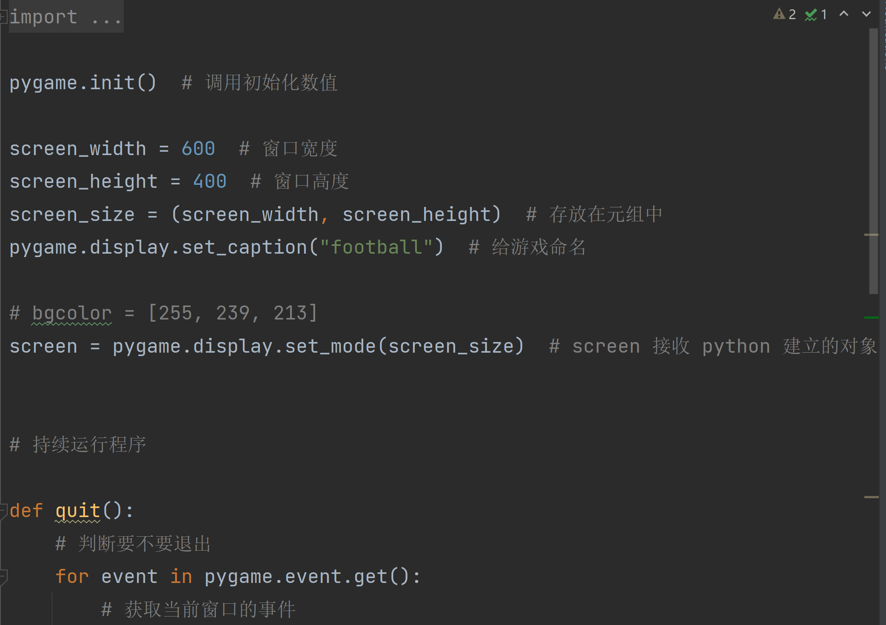
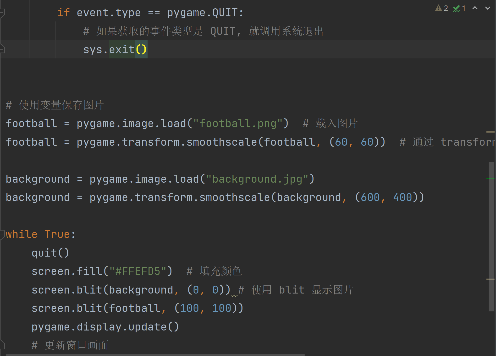
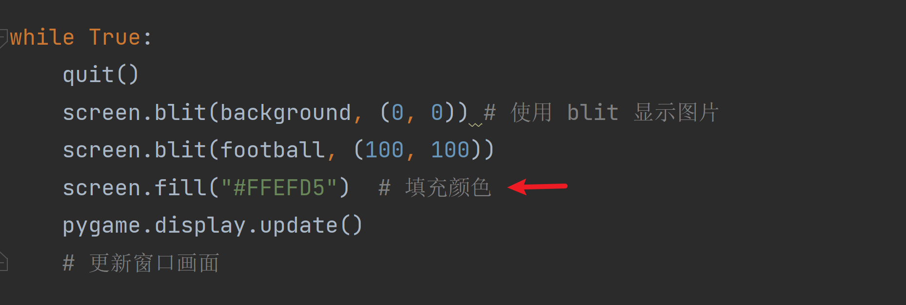
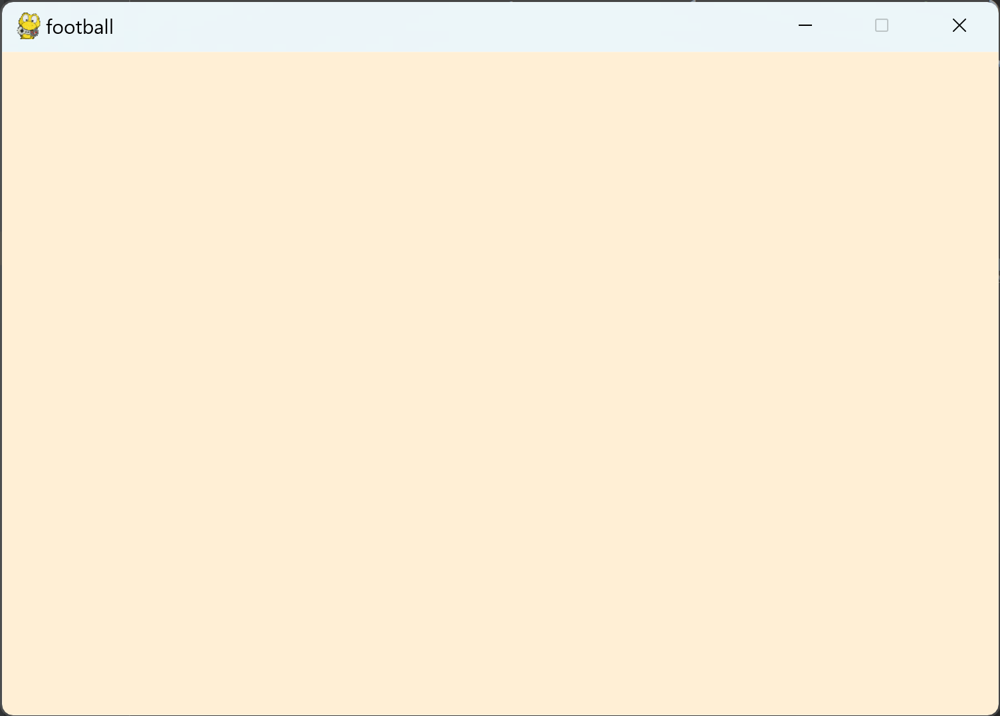
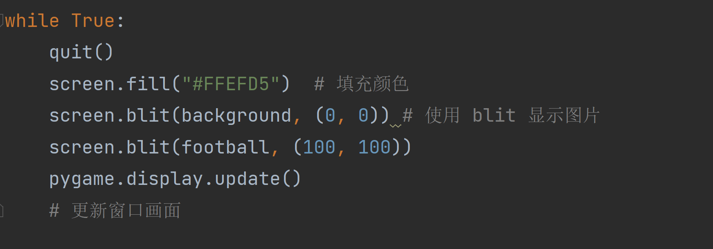

## 第十一课

#### --编写python程序

#### --一个新发现

当我把背景填充的代码放在后面时：

这条代码最后运行，所以会覆盖前面的内容：

------------------------------------------------------------------------------------------------------------------------------------------------------

但是如果我将背景填充的代码放在前面：

这条代码会率先运行，后面的内容则会覆盖在其之上：

