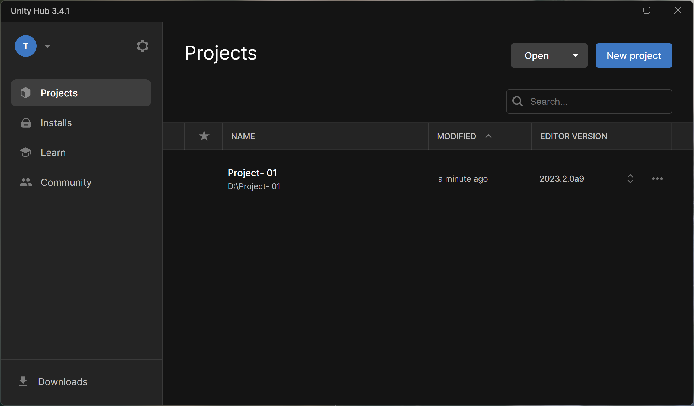

## 第十九课

关于为什么没有17和18课—— 因为一直在下载Unity环境，基本啥都没干

#### --游戏制作需求

- 运行平台

    - 安卓
    - IOS

- 操作方法

    - 点击屏幕

- 游戏场景

    - 公路
    - 小河
    - 草地

- 游戏性

    - 青蛙可以向上中下三个方向移动
    - 相机随方向同时移动
    - 点击跳跃
        - 长按蓄力
    - 碰到障碍物游戏结束
    - 倒计时或无限游戏

- 额外功能

    - 记录得分或距离生成本地排行榜

        - 死亡后查看
        - 主页Button查看

    - 死亡播放广告

        

    

​      