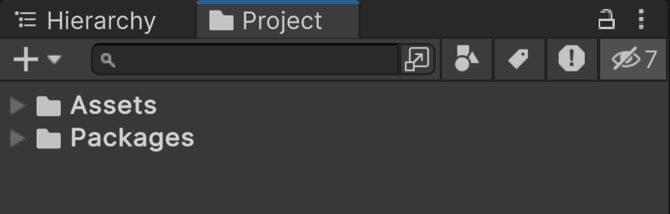
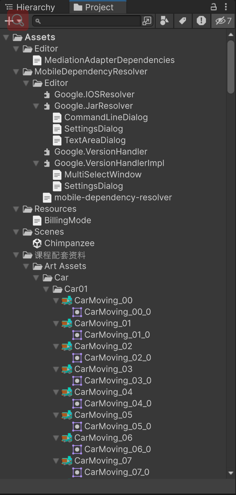
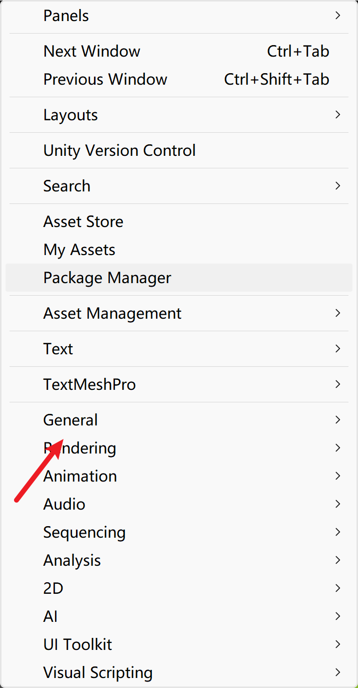
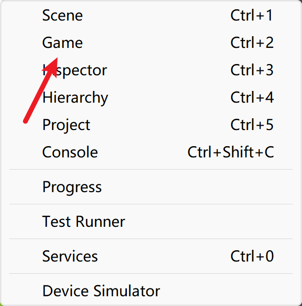
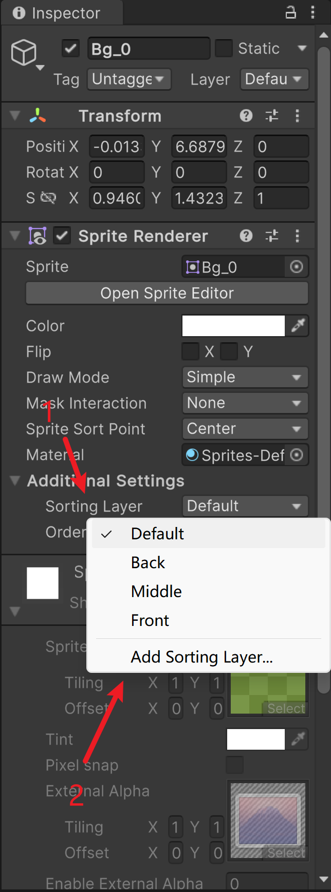
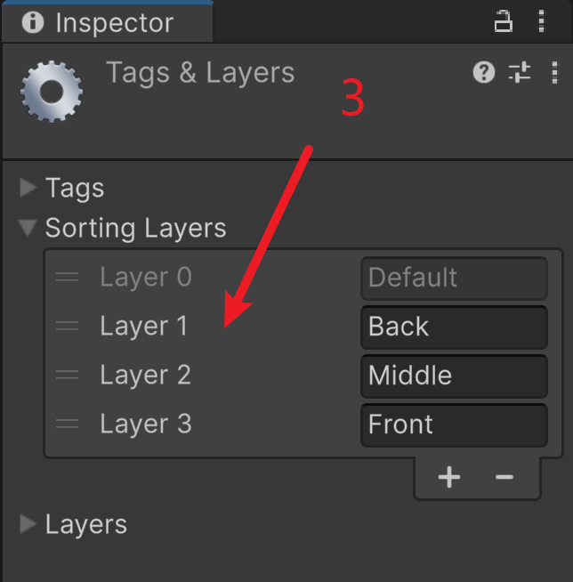
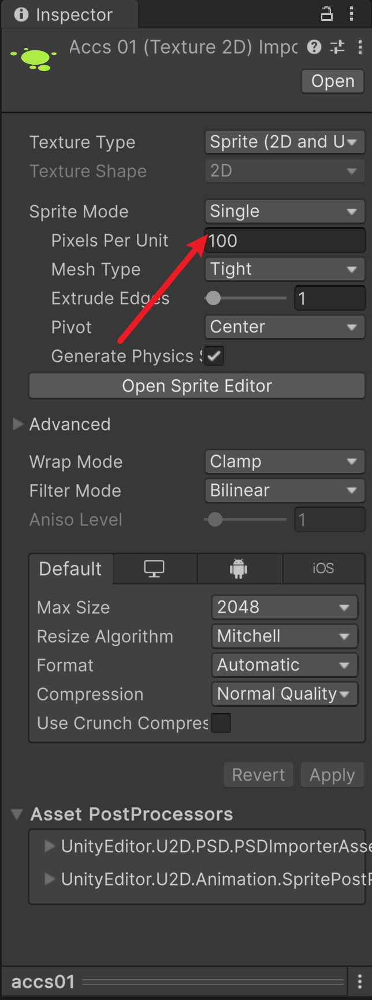

## 第二十一课

#### --快捷展开和关闭文件夹 (在点击文件夹的时候按住Alt)

#### 关闭所有子文件夹

#### 打开所有子文件夹

#### --找回“Game”

#### --层数优先级

#### 添加了 Back, Middle, Front 三层，Layer 1 即为最低端，Layer 3 即为最顶端

#### 层数高的可以覆盖比它层数低的物品

#### 比如，Layer 3 可以覆盖 Layer 2 和 Layer 1

#### --图片显示

 

#### 若遇到图片显示不完全，可以尝试选中资源并将 Sprite Mode 设为 Single