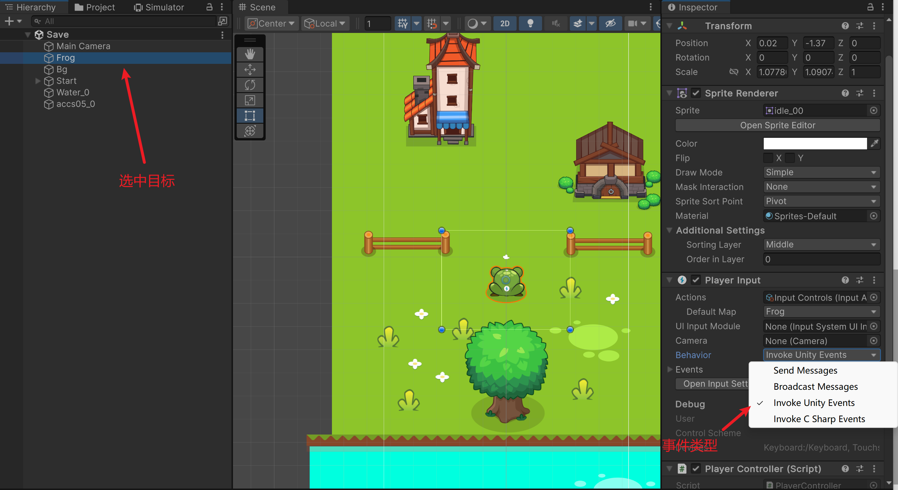
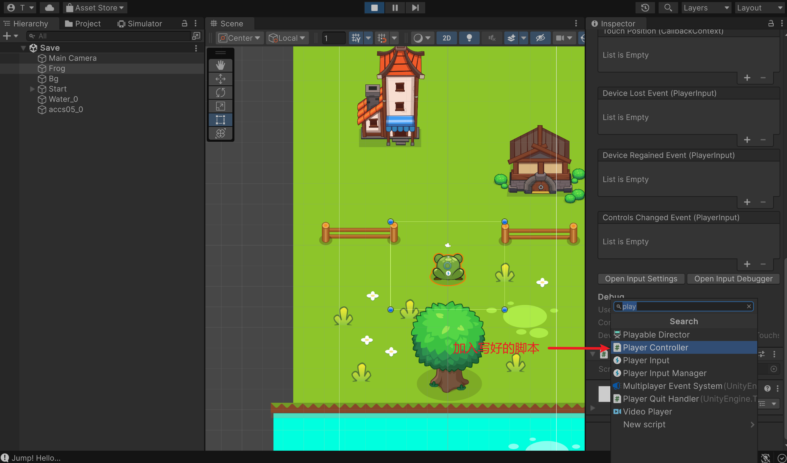
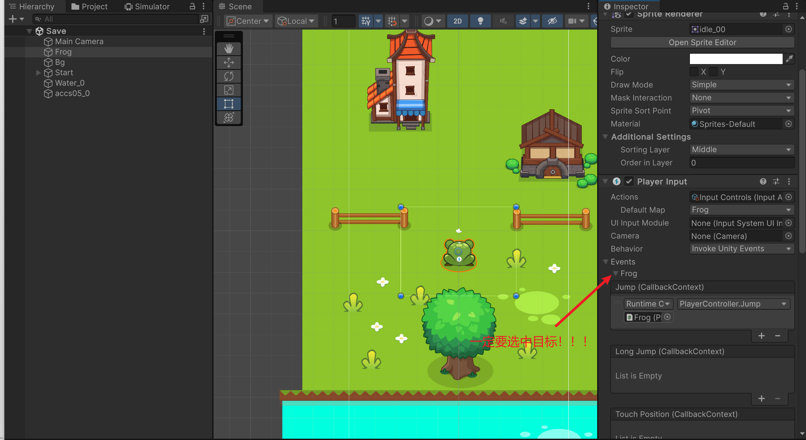
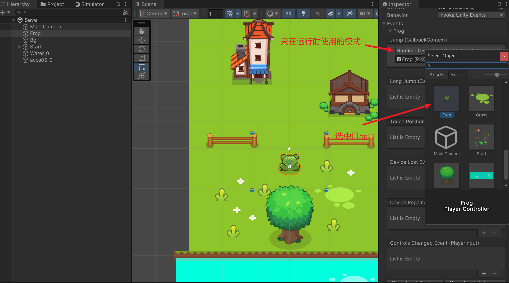
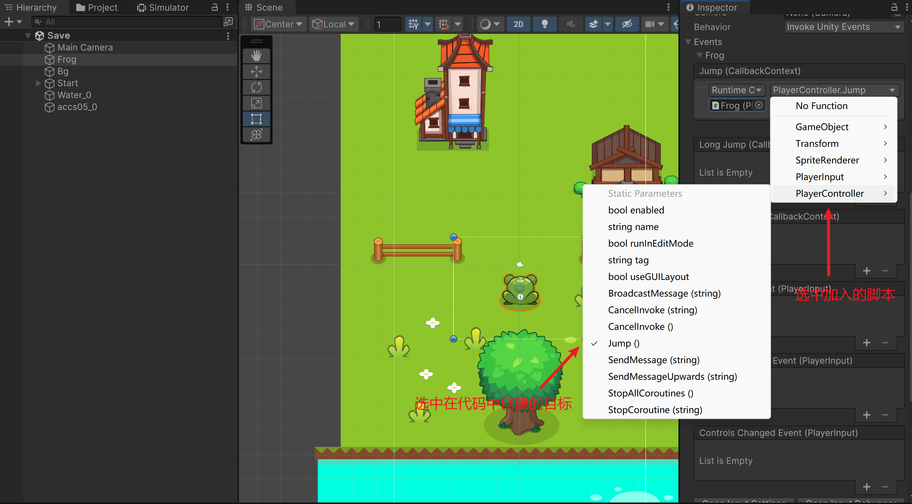
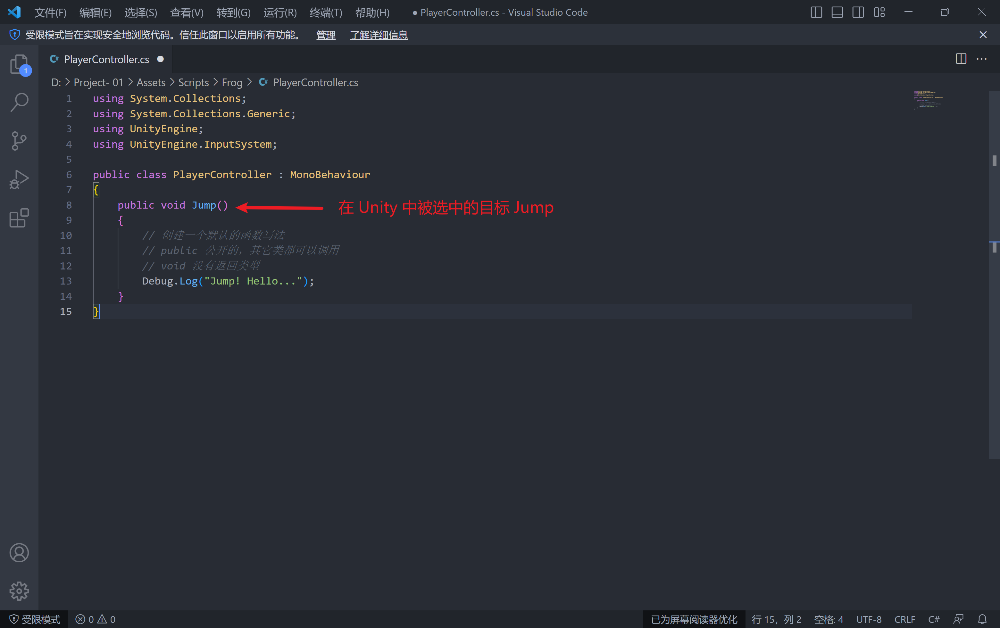
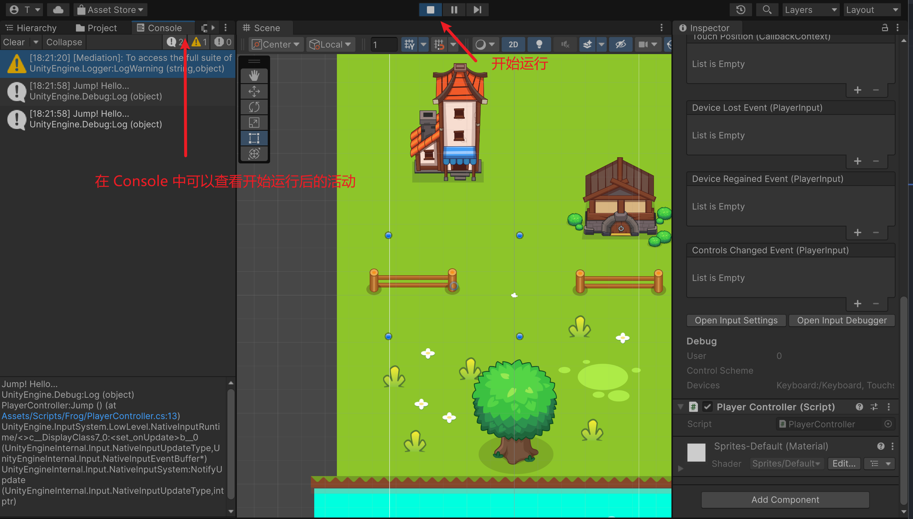

## 第二十四课

#### --编写代码 (PlayerController)

```c#
using System.Collections;
using System.Collections.Generic;
using UnityEngine;

public class PlayerControl : MonoBehaviour
{
    // Start is called before the first frame update
    //在开始的第一帧启动
    void Start()
    {
        
    }

    // Update is called once per frame
    //循环执行，即为每一帧都会执行一遍
    //游戏不断的动作要放在 update 中进行
    void Update()
    {
        
    }
}

```

```c#
using System.Collections;
using System.Collections.Generic;
using UnityEngine;
using UnityEngine.InputSystem;

public class PlayerControl : MonoBehaviour
{
    pubilc void Jump()
    {
        //TODO：执行跳跃，跳跃的距离，记录分数，播放跳跃的音效
        //创建一个默认的函数写法
        //带有 public 标识的代码，其他类都可以调用
        // void 没有返回类型
        Debug.Log("Jump! Hello...");
    }
}

```

#### --带入程序














