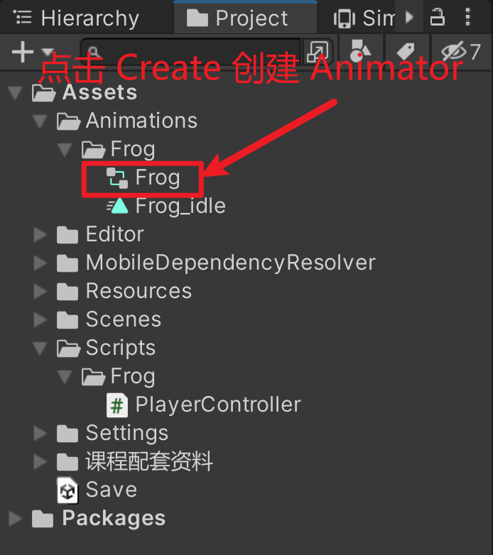
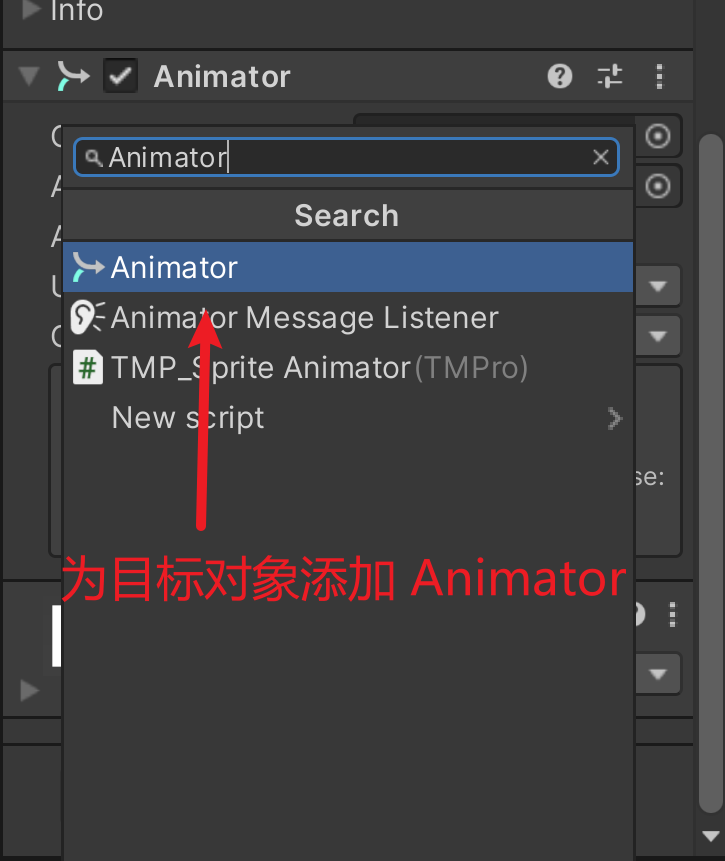
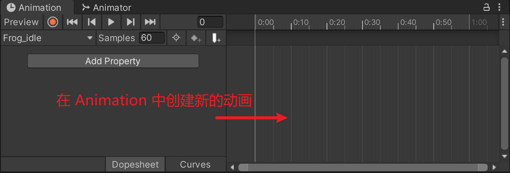

## 第二十八课

#### --解决青蛙连续跳跃的问题

~~~c#
using System.Collections;
using System.Collections.Generic;
using UnityEngine;
using UnityEngine.InputSystem;

public class PlayerController : MonoBehaviour
{
    private Rigidbody2D rb;
    public float jumpDistance;
    private float moveDistance; // 真实的跳跃距离
    private bool buttonHeld;  //判断是否长按
    private Vector2 destination; // 储存计算的值
    private bool isJump;

    public void Jump(InputAction.CallbackContext context){
        // 创建一个默认的函数写法
        // private 获取 Frog 自身的 Rigidbody2D 组件
        // public 公开的，其它类都可以调用
        // void 没有返回类型s
        if(context.performed && !isJump){ 
            // 只有在功能完全输出后，我们才有里面的内容
            moveDistance = jumpDistance;
            Debug.Log("Jump!" + "" + moveDistance);
            // 执行跳跃
            destination = new Vector2(transform.position.x, transform.position.y + moveDistance);
            isJump = true;
        }
    }

private void Update(){
        // 每更新一次，就判定是否要将 isJump 改为 false
        if (destination.y - transform.position.y < 0.1f){
        // 如果跳跃的距离，减去判定的距离小于 0.1 的话，就代表青蛙要落地了
        // 避免连续跳跃
            isJump = false;
        }
    }

    public void Awake(){ //在 start 之前执行

        rb = GetComponent<Rigidbody2D>(); // 获取自身的组件
        
    }
    private void FixedUpdate(){
        // 在 FixedUpdate 中执行物理模块

        if (isJump){

        rb.position = Vector2.Lerp(a:transform.position, b:destination, t:0.134f);
        // 坐标 + moveDistance = 目标坐标
        }
    }
    public void LongJump(InputAction.CallbackContext context){
        if (context.performed && !isJump){
            moveDistance = jumpDistance * 2;
            // 小跳就是 jumpDistance
            // 大跳是 jumpDistance 的两倍
            buttonHeld = true;
        }
        if (context.canceled && buttonHeld && !isJump){
            // 执行跳跃
            
            Debug.Log("Long Jump!" + "" + moveDistance);
            buttonHeld = false;
            destination = new Vector2(transform.position.x, transform.position.y + moveDistance);
            isJump = true;

        }
    }

    public void GetTouchPosition(InputAction.CallbackContext context){

    }
}
~~~

#### --创建动画

#### 你可以在 Window 中找到 Animation

